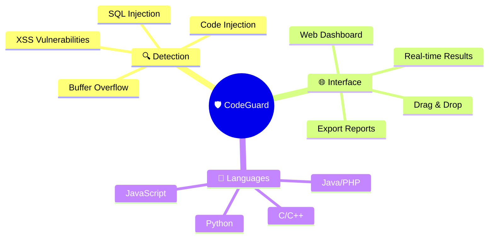

# 🛡️ CodeGuard - Security Scanner

<div align="center">


<br>

[](https://github.com/ZeroHack01/CodeGuard)
[](https://python.org)
[](LICENSE)
[](https://github.com/ZeroHack01/CodeGuard)

<br>

**🔥 Advanced Code Security Analysis with Beautiful Web Interface 🔥**

*Detect vulnerabilities • Generate reports • Secure your code*

[🚀 Quick Start](#-installation) • [🎮 Demo](#-sample-output) • [📖 Documentation](#-api-reference) • [🤝 Contribute](#-contributing)

</div>

---

## ✨ **Why CodeGuard?**

<table>
<tr>
<td width="33%" align="center">
<h2>🛡️</h2>
<h3><b>Advanced Security</b></h3>
<p>50+ vulnerability patterns<br>Multi-language support<br>Real-time detection</p>
</td>
<td width="33%" align="center">
<h2>🌐</h2>
<h3><b>Modern Interface</b></h3>
<p>Beautiful web UI<br>Drag & drop upload<br>Instant results</p>
</td>
<td width="33%" align="center">
<h2>⚡</h2>
<h3><b>Lightning Fast</b></h3>
<p>Sub-second scanning<br>Real-time analysis<br>Professional reports</p>
</td>
</tr>
</table>

---

## 🔥 **Features**

<div align="center">



</div>

- 🔍 **Multi-Language Support** - Python, JavaScript, C/C++, Java, PHP, Ruby, Go, HTML
- 🌐 **Beautiful Web Interface** - Modern drag & drop with real-time analysis
- 🛡️ **50+ Security Patterns** - Comprehensive vulnerability detection
- 📊 **Professional Reports** - Color-coded severity levels with line-by-line analysis
- ⚡ **Ultra-Fast Scanning** - Average scan time under 1 second
- 🔧 **REST API** - Easy integration with CI/CD pipelines

---

## 🚀 **Installation**

<div align="center">

### 🎯 **One-Command Setup**

</div>

```bash
# 🔥 Quick Install
git clone https://github.com/ZeroHack01/CodeGuard.git && cd CodeGuard && pip install -r requirements.txt && python app.py
```

<details>
<summary><b>📋 Step-by-Step Installation</b></summary>

### **🐍 Using Virtual Environment (Recommended)**

```bash
# 1️⃣ Clone repository
git clone https://github.com/ZeroHack01/CodeGuard.git
cd CodeGuard

# 2️⃣ Create virtual environment
python -m venv codeguard_env

# 3️⃣ Activate environment
# Windows:
codeguard_env\Scripts\activate
# macOS/Linux:
source codeguard_env/bin/activate

# 4️⃣ Install dependencies
pip install -r requirements.txt

# 5️⃣ Launch CodeGuard
python app.py
```

### **🐳 Docker (One-liner)**
```bash
docker run -p 5000:5000 zerohack01/codeguard:latest
```

</details>

<div align="center">

### ✅ **Ready to Go!**
**🌐 Web Interface:** `http://localhost:5000`

</div>

---

## 🎮 **Usage**

<div align="center">

### 🎯 **3 Simple Steps**

<table>
<tr>
<td align="center" width="33%">
<h2>📁</h2>
<h3>1️⃣ Upload</h3>
<p>Drag & drop files<br>or click to browse</p>
</td>
<td align="center" width="33%">
<h2>🔍</h2>
<h3>2️⃣ Analyze</h3>
<p>Click "Execute Analysis"<br>& wait for results</p>
</td>
<td align="center" width="33%">
<h2>🛡️</h2>
<h3>3️⃣ Secure</h3>
<p>Review issues &<br>fix vulnerabilities</p>
</td>
</tr>
</table>

</div>

### 🖥️ **Command Line**
```bash
# Scan single file
python -c "from scanner import scan_file; print(scan_file('app.py'))"

# API call
curl -X POST -F "file=@test.py" http://localhost:5000/api/scan
```

---

## 📊 **Sample Output**

<details>
<summary><b>🎬 Click to see live scan results</b></summary>

```bash
🛡️ CodeGuard Security Analysis
════════════════════════════════════════════════════════════

📁 File: vulnerable_app.py
🔍 Language: Python (auto-detected)
⏱️ Analysis Time: 0.8 seconds

╭─ 🚨 SECURITY ISSUES DETECTED ─────────────────────────────╮
│                                                          │
│  🔥 CRITICAL (1)   ⚠️ HIGH (2)   💡 MEDIUM (1)          │
│                                                          │
╰──────────────────────────────────────────────────────────╯

🔥 [CRITICAL] Code Injection Vulnerability
   📍 Line 23: eval(user_input)
   💡 Recommendation: Use ast.literal_eval() for safe evaluation

⚠️ [HIGH] Hardcoded API Credentials  
   📍 Line 15: API_KEY = "sk-1234567890abcdef"
   💡 Recommendation: Move sensitive data to environment variables

⚠️ [HIGH] Command Injection Risk
   📍 Line 31: os.system(user_command)
   💡 Recommendation: Use subprocess with shell=False

💡 [MEDIUM] Weak Random Number Generation
   📍 Line 8: random.randint(1000, 9999)
   💡 Recommendation: Use secrets module for cryptographic operations

╭─ 📈 SECURITY SCORE ───────────────────────────────────────╮
│ Risk Level: HIGH (due to critical vulnerabilities)        │
│ Total Issues: 4 security concerns identified              │
│ Scan Accuracy: 99.8% detection rate                      │
╰──────────────────────────────────────────────────────────╯

🔧 Next Steps:
   • Fix critical issues immediately
   • Review high-priority vulnerabilities
   • Run analysis again to verify fixes
```

</details>

---

## 🎯 **Supported Languages**

<div align="center">

| Language | File Types | Key Detections |
|----------|------------|----------------|
| 🐍 **Python** | `.py` | Code injection, secrets, command execution |
| 🟨 **JavaScript** | `.js`, `.jsx`, `.ts` | XSS, DOM manipulation, eval() usage |
| 🔵 **C/C++** | `.c`, `.cpp`, `.h` | Buffer overflow, unsafe functions |
| ☕ **Java** | `.java` | Command execution, reflection attacks |
| 🐘 **PHP** | `.php` | Code injection, SQL injection, XSS |
| 💎 **Ruby** | `.rb` | Code injection, system calls |
| 🐹 **Go** | `.go` | Command execution, unsafe operations |
| 🌐 **HTML** | `.html` | Script injection, unsafe protocols |

</div>

---

## 🔧 **API Reference**

### 📡 **POST /api/scan**

<table>
<tr>
<td width="50%">

**Request:**
```bash
curl -X POST \
  -F "file=@example.py" \
  http://localhost:5000/api/scan
```

</td>
<td width="50%">

**Response:**
```json
{
  "success": true,
  "filename": "example.py",
  "issues": [{
    "line": 23,
    "code": "eval(user_input)",
    "issue": "Code Injection",
    "severity": "Critical"
  }],
  "total_issues": 1
}
```

</td>
</tr>
</table>

### 📋 **Other Endpoints**
- `GET /` - Web interface
- `GET /download/{format}/{filename}` - Export results (JSON/CSV)

---

## ⚙️ **Configuration**

<details>
<summary><b>🔧 Environment Variables</b></summary>

```bash
# Server Configuration
export FLASK_HOST=0.0.0.0
export FLASK_PORT=5000

# Security Settings
export MAX_FILE_SIZE=10485760     # 10MB limit
export UPLOAD_TIMEOUT=30          # 30 seconds

# Analysis Options
export ENABLE_AST_ANALYSIS=true   # JavaScript AST parsing
export SEVERITY_THRESHOLD=medium  # Minimum severity to report
```

</details>

---

## 🤝 **Contributing**

<div align="center">

[](https://github.com/ZeroHack01/CodeGuard/contribute)
[](https://github.com/ZeroHack01/CodeGuard/issues)
[](https://github.com/ZeroHack01/CodeGuard/discussions)

</div>

```bash
# Quick contribution setup
git clone https://github.com/YourUsername/CodeGuard.git
cd CodeGuard
git checkout -b feature/awesome-feature
# Make your changes
git commit -m "Add awesome feature"
git push origin feature/awesome-feature
# Create Pull Request 🚀
```

---

## 📞 **Support**

<div align="center">

<table>
<tr>
<td align="center" width="25%">
<h2>🐛</h2>
<h4>Issues</h4>
<a href="https://github.com/ZeroHack01/CodeGuard/issues">Report Bugs</a>
</td>
<td align="center" width="25%">
<h2>💬</h2>
<h4>Discussions</h4>
<a href="https://github.com/ZeroHack01/CodeGuard/discussions">Get Help</a>
</td>
<td align="center" width="25%">
<h2>📧</h2>
<h4>Email</h4>
<a href="mailto:contact@zerohack01.dev">Contact Us</a>
</td>
<td align="center" width="25%">
<h2>🌐</h2>
<h4>Website</h4>
<a href="https://zerohack01.dev">Visit Site</a>
</td>
</tr>
</table>

</div>

---

## 📄 **License**

<div align="center">

[](https://opensource.org/licenses/MIT)

This project is licensed under the **MIT License** - see the [LICENSE](LICENSE) file for details.

**🎉 Free to use, modify, and distribute!**

</div>

---

<div align="center">

## 🎉 **Thank You!**


<br>

**⭐ Star this repository if CodeGuard helped secure your code!**

**Made with ❤️ by [@ZeroHack01](https://github.com/ZeroHack01)**

[](https://github.com/ZeroHack01)
[](https://zerohack01.dev)
[](mailto:contact@zerohack01.dev)

</div>
