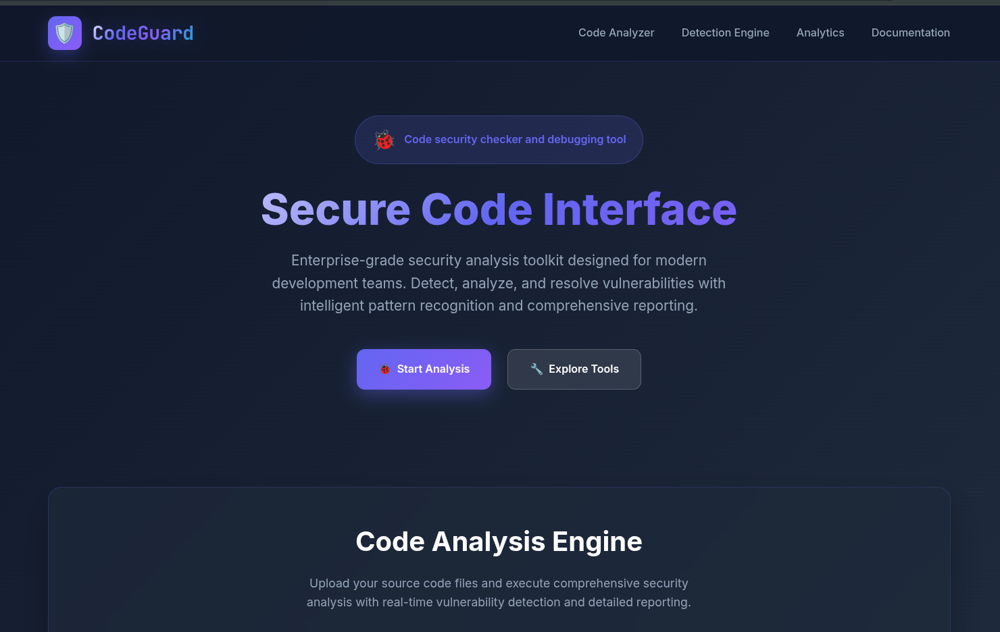

<div align="center">

<!-- Animated Wave Header -->


<br/>


<br/>


<br/>

**Static code analysis tool for security vulnerability detection**

[🚀 Install](#installation) • [📖 Usage](#usage) • [🔧 API](#api-reference) • [🌐 Languages](#supported-languages)

</div>

---

## 🛡️ **What CodeGuard Does**

CodeGuard is a static code analyzer that scans source code files to identify security vulnerabilities using pattern matching and basic static analysis.

<table>
<tr>
<td width="50%">

**🔍 Security Checks:**
- Code injection vulnerabilities
- Hardcoded credentials & secrets
- Command injection patterns
- Buffer overflow risks (C/C++)
- XSS patterns (Web files)
- SQL injection indicators
- Unsafe function usage

</td>
<td width="50%">

**📊 Output Features:**
- Line-by-line issue reporting
- Severity classification
- Fix recommendations
- Web interface dashboard
- JSON/CSV export options
- REST API access
- Real-time scan results

</td>
</tr>
</table>

---

## 🚀 **Installation**

<div align="center">

### Cross-Platform Setup

</div>

<table>
<tr>
<td width="33%" align="center">

### 🪟 Windows

```powershell
# PowerShell
git clone https://github.com/ZeroHack01/CodeGuard.git
cd CodeGuard

# Create virtual environment
python -m venv venv
venv\Scripts\activate

# Install dependencies
pip install -r requirements.txt

# Start scanner
python app.py
```

</td>
<td width="33%" align="center">

### 🍎 macOS

```bash
# Terminal
git clone https://github.com/ZeroHack01/CodeGuard.git
cd CodeGuard

# Create virtual environment
python3 -m venv venv
source venv/bin/activate

# Install dependencies
pip3 install -r requirements.txt

# Start scanner
python3 app.py
```

</td>
<td width="33%" align="center">

### 🐧 Linux

```bash
# For Ubuntu/Debian
sudo apt update
sudo apt install python3 python3-pip python3-venv git

# For CentOS/RHEL/Fedora
sudo yum install python3 python3-pip git  # CentOS/RHEL
sudo dnf install python3 python3-pip git  # Fedora

# Clone and setup
git clone https://github.com/ZeroHack01/CodeGuard.git
cd CodeGuard

# Create virtual environment
python3 -m venv venv
source venv/bin/activate

# Install dependencies
pip3 install -r requirements.txt

# Start scanner
python3 app.py
```

</td>
</tr>
</table>

<div align="center">

### 🐳 Docker Installation

```bash
# Option 1: Pull from Docker Hub
docker pull zerohack01/codeguard:latest
docker run -d -p 5000:5000 --name codeguard zerohack01/codeguard:latest

# Option 2: Build from source
git clone https://github.com/ZeroHack01/CodeGuard.git
cd CodeGuard
docker build -t codeguard .
docker run -d -p 5000:5000 --name codeguard codeguard

# Stop container
docker stop codeguard

# Remove container
docker rm codeguard
```

**🌐 Access web interface:** `http://localhost:5000`

</div>

---

## 📖 **Usage Guide**

### 🖥️ **Web Interface**

<div align="center">

**CodeGuard Dashboard Interface**

*Upload files using drag-and-drop or file selection. The dashboard shows real-time scanning progress and provides access to all security analysis features.*

> **📸 To add actual screenshots:**
> 1. Run CodeGuard: `python app.py`
> 2. Open `http://localhost:5000` in your browser
> 3. Take a screenshot of the dashboard
> 4. Save as `screenshots/dashboard.png` in your repository
> 5. Update this README to include: ``

</div>

### 📊 **Scan Results Interface**

<div align="center">

**Real-time Vulnerability Detection Results**

*Interactive results page showing security issues with severity levels, code snippets, line numbers, and detailed fix recommendations.*

> **📸 To add scan results screenshot:**
> 1. Upload a test file with known vulnerabilities
> 2. Complete a security scan
> 3. Take a screenshot of the results page
> 4. Save as `screenshots/results.png` in your repository
> 5. Update this README to include: ``

</div>

### 🖥️ **Platform Usage**

<table>
<tr>
<td width="33%" align="center">

### 🪟 Windows
1. Open browser: `localhost:5000`
2. Upload code files
3. Click "Execute Analysis"
4. Review vulnerability report

</td>
<td width="33%" align="center">

### 🍎 macOS
1. Navigate to `localhost:5000`
2. Drag & drop files
3. Start security scan
4. Export results if needed

</td>
<td width="33%" align="center">

### 🐧 Linux
1. Open Firefox/Chrome: `localhost:5000`
2. Select files for scanning
3. Run vulnerability analysis
4. Download detailed reports

</td>
</tr>
</table>

### 💻 **Command Line Usage**

```python
# Direct file scanning
from scanner import scan_file
results = scan_file('example.py')
for issue in results:
    print(f"Line {issue['line']}: {issue['issue']}")
```

```bash
# API call
curl -X POST -F "file=@test.py" http://localhost:5000/api/scan
```

---

## 📊 **Sample Output**

<details>
<summary><b>🔍 Example scan results</b></summary>

```json
{
  "filename": "app.py",
  "language": "python",
  "scan_time": 0.8,
  "issues": [
    {
      "line": 23,
      "code": "eval(user_input)",
      "issue": "Code Injection",
      "severity": "Critical",
      "description": "Dynamic code execution detected"
    },
    {
      "line": 15,
      "code": "password = 'admin123'",
      "issue": "Hardcoded Password",
      "severity": "High",
      "description": "Credentials found in source code"
    },
    {
      "line": 31,
      "code": "os.system(command)",
      "issue": "Command Injection",
      "severity": "High",
      "description": "System command execution risk"
    }
  ],
  "summary": {
    "total_issues": 3,
    "critical": 1,
    "high": 2,
    "medium": 0
  }
}
```

</details>

---

## 🌐 **Supported Languages**

<div align="center">

| Language | File Types | Security Patterns |
|----------|------------|-------------------|
| 🐍 **Python** | `.py .pyw` | eval(), exec(), os.system(), hardcoded secrets |
| 🟨 **JavaScript** | `.js .jsx` | innerHTML, eval(), XSS patterns, DOM risks |
| ⚡ **TypeScript** | `.ts .tsx` | Type safety issues, XSS vulnerabilities |
| 🔵 **C/C++** | `.c .cpp .h` | gets(), strcpy(), buffer overflows, system() |
| ☕ **Java** | `.java` | Runtime.exec(), reflection, path traversal |
| 🐘 **PHP** | `.php` | eval(), shell_exec(), SQL injection, file inclusion |
| 💎 **Ruby** | `.rb` | eval(), system(), command injection |
| 🐹 **Go** | `.go` | exec.Command(), unsafe operations |
| 🌐 **HTML** | `.html` | Script injection, unsafe protocols |

</div>

---

## 🔧 **API Reference**

### 📡 **Available Endpoints**

| Method | Endpoint | Purpose |
|--------|----------|---------|
| `POST` | `/api/scan` | Upload and scan file |
| `GET` | `/` | Access web interface |
| `GET` | `/download/{format}/{filename}` | Export scan results |

### 📝 **Scan Request**

```bash
curl -X POST \
  -F "file=@source_code.py" \
  -H "Content-Type: multipart/form-data" \
  http://localhost:5000/api/scan
```

### 📋 **Response Format**

```json
{
  "success": true,
  "filename": "source_code.py",
  "language": "python",
  "issues": [
    {
      "line": 15,
      "code": "eval(data)",
      "issue": "Code Injection",
      "severity": "Critical"
    }
  ],
  "total_issues": 1
}
```

---

## ⚙️ **Configuration**

<details>
<summary><b>🔧 Environment Settings</b></summary>

```bash
# Server Configuration
FLASK_HOST=0.0.0.0
FLASK_PORT=5000
FLASK_DEBUG=false

# File Processing
MAX_FILE_SIZE=10485760    # 10MB limit
UPLOAD_TIMEOUT=30         # 30 seconds

# Scanner Options
ENABLE_AST_ANALYSIS=true  # JavaScript AST parsing
SEVERITY_THRESHOLD=medium # Minimum severity to report
EXPORT_FORMATS=json,csv   # Available export formats
```

</details>

---

## 📸 **Adding Screenshots**

To update this README with actual screenshots of your CodeGuard application:

### Step 1: Create Screenshots Directory
```bash
mkdir screenshots
```

### Step 2: Take Screenshots
1. **Dashboard Screenshot:**
   - Run: `python app.py`
   - Open: `http://localhost:5000`
   - Take screenshot and save as: `screenshots/dashboard.png`

2. **Results Screenshot:**
   - Upload a test file with vulnerabilities
   - Complete scan and view results
   - Take screenshot and save as: `screenshots/results.png`

### Step 3: Update README
Replace the placeholder text with actual image references:
```markdown


```

---

## 🧪 **Testing CodeGuard**

Create a test file with known vulnerabilities:

```python
# test_vulnerable.py
api_key = "sk-1234567890abcdef"    # Hardcoded credential
user_code = input("Enter code: ")
eval(user_code)                    # Code injection
os.system("ls " + user_path)       # Command injection
```

Expected result: 3 security issues detected

---

## 🤝 **Contributing**

1. Fork this repository
2. Create feature branch: `git checkout -b new-feature`
3. Make your changes and test
4. Commit changes: `git commit -m "Add new feature"`
5. Push to branch: `git push origin new-feature`
6. Submit Pull Request

---

## 📄 **License**

This project is licensed under the MIT License - see [LICENSE](LICENSE) file for complete details.

---

<!-- Animated Wave Footer -->


<div align="center">


<br/>

**[🐛 Report Issues](https://github.com/ZeroHack01/CodeGuard/issues) • [💼 LinkedIn](https://www.linkedin.com/in/mongwoi/) • [📧 Email](mailto:mongwoiching2080@gmail.com)**

[](https://github.com/ZeroHack01)

**⭐ Star this repository if CodeGuard helped secure your code!**

</div>
