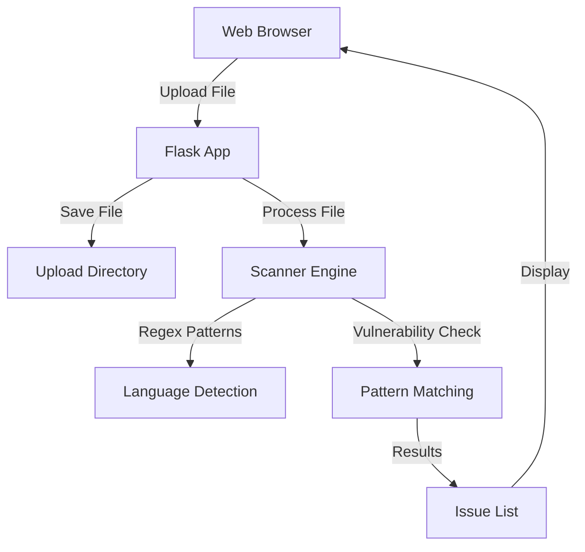

# 🛡️ CodeGuard

<div align="center">


**🔍 Web-Based Code Vulnerability Scanner with GUI Interface**

[](https://python.org)
[](https://flask.palletsprojects.com/)
[](https://github.com/ZeroHack01/CodeGuard)
[](LICENSE)

*Upload • Scan • Secure - All through your browser* 🌐

[🚀 **Quick Start**](#-quick-start) • [🖥️ **Screenshots**](#️-screenshots) • [🔧 **Usage**](#-usage) • [🤝 **Contributing**](#-contributing)

</div>

---

## 🌟 **What is CodeGuard?**

**CodeGuard** is a powerful web-based code security scanner that detects vulnerabilities across multiple programming languages through an intuitive GUI interface. Built with Flask, it provides an easy-to-use platform for developers to upload and analyze their code files for common security issues.

### ✨ **Why CodeGuard?**

- 🌐 **Web-Based Interface** - No installation required, runs in your browser
- 🔍 **Multi-Language Support** - Scans 8+ programming languages
- ⚡ **Real-Time Analysis** - Instant vulnerability detection
- 📊 **Detailed Reports** - Line-by-line issue breakdown
- 🎯 **Pattern-Based Detection** - Uses regex patterns for accurate scanning
- 🔒 **Security Focused** - Identifies common OWASP vulnerabilities

---

## 🚀 **Supported Languages & Detection**

<table>
<tr>
<td width="33%">

### 🐍 **Python**
- ⚠️ `eval()` - Code Injection
- ⚠️ `exec()` - Dangerous Execution
- ⚠️ `os.system()` - Shell Execution
- ⚠️ `subprocess` calls
- ⚠️ Hardcoded passwords
- ✅ **Syntax Error Detection**

</td>
<td width="33%">

### 🟨 **JavaScript**
- ⚠️ `document.write()` - XSS risk
- ⚠️ `eval()` - Code Injection
- ⚠️ DOM manipulation risks
- ⚠️ Unsafe HTML insertion

### 🌐 **PHP**
- ⚠️ `eval()` - Code Injection
- ⚠️ Hardcoded DB passwords
- ⚠️ SQL injection patterns
- ⚠️ File inclusion vulnerabilities

</td>
<td width="33%">

### 🐚 **Shell Scripts**
- ⚠️ Dangerous `eval` usage
- ⚠️ `rm -rf` commands
- ⚠️ `curl | bash` patterns
- ⚠️ Unsafe variable expansion

### ☕ **Java**
- ⚠️ `Runtime.exec()` - Shell Execution
- ⚠️ Hardcoded credentials
- ⚠️ SQL injection risks

</td>
</tr>
</table>

<div align="center">

### **Also Supports:** C/C++ • HTML • And More!

</div>

---

## 🎯 **Quick Start**

### 📋 **Prerequisites**

```bash
# Ensure Python 3.7+ is installed
python --version

# Install Flask (if not already installed)
pip install flask
```

### 🔧 **Installation & Setup**

```bash
# Clone the repository
git clone https://github.com/ZeroHack01/CodeGuard.git
cd CodeGuard

# Install dependencies
pip install -r requirements.txt

# Run the application
python app.py
```

### 🌐 **Access the Web Interface**

```bash
# Open your browser and navigate to:
http://localhost:5000
```

---

## 🔧 **Usage**

### 📤 **File Upload Process**

1. **🌐 Open your browser** and go to `http://localhost:5000`
2. **📁 Click "Choose File"** and select your code file
3. **🚀 Click "Upload & Scan"** to start the analysis
4. **📊 View Results** with detailed line-by-line vulnerability reports

### 🎯 **Supported File Extensions**

```
✅ Python     (.py)
✅ JavaScript (.js)  
✅ PHP        (.php)
✅ HTML       (.html)
✅ Shell      (.sh)
✅ Java       (.java)
✅ C/C++      (.c, .cpp)
```

### 📊 **Example Scan Results**

```
🧾 Results for: vulnerable_code.py (Language: PYTHON)

Line 15: password = "admin123"
⚠️ Issue: Hardcoded password

Line 23: eval(user_input)
⚠️ Issue: eval() - Code Injection

Line 31: os.system(command)
⚠️ Issue: os.system() - Shell Execution

✅ Scan completed: 3 vulnerabilities found
```

---

## 🏗️ **Project Structure**

```
CodeGuard/
├── 📄 app.py              # Main Flask application
├── 🔍 scanner.py          # Core scanning engine
├── 📁 templates/
│   └── 🌐 index.html     # Web interface
├── 📁 static/
│   ├── 🎨 style.css      # Custom styling
│   └── ⚡ script.js      # Frontend logic
├── 📁 uploads/            # Temporary file storage
├── 📋 requirements.txt    # Python dependencies
└── 📖 README.md          # This file
```

---

## ⚙️ **Core Features**

### 🔍 **Pattern-Based Scanning Engine**

The scanner uses regex patterns to identify vulnerabilities:

```python
# Example: Python vulnerability patterns
'python': {
    "eval() - Code Injection": r"\beval\s*\(",
    "exec() - Dangerous Execution": r"\bexec\s*\(",
    "os.system() - Shell Execution": r"os\.system\s*\(",
    "subprocess call": r"subprocess\.(call|run|Popen)",
    "Hardcoded password": r"password\s*=\s*[\"'].*[\"']"
}
```

### 🎨 **Web Interface Features**

- **🔄 Drag & Drop** file upload
- **📊 Real-time** scan progress
- **🎯 Syntax highlighting** for detected issues  
- **📱 Responsive design** for mobile/desktop
- **🌈 Color-coded** severity levels

### 🔧 **Language Detection**

Automatic language detection based on file extensions:

```python
def get_language(file_path):
    ext = file_path.split('.')[-1].lower()
    return {
        'py': 'python',
        'js': 'javascript', 
        'php': 'php',
        'html': 'html',
        'sh': 'shell',
        'java': 'java',
        'c': 'c',
        'cpp': 'cpp'
    }.get(ext, 'unknown')
```

---

## 🛠️ **Advanced Configuration**

### 🔧 **Adding Custom Patterns**

You can extend the scanner by adding custom vulnerability patterns:

```python
# In scanner.py - add new patterns
'python': {
    "Custom SQL Injection": r"cursor\.execute\s*\(\s*[\"'].*%.*[\"']",
    "Unsafe pickle usage": r"\bpickle\.loads?\s*\(",
    # Add your custom patterns here
}
```

### 🎛️ **Modifying File Extensions**

```python
# In app.py - extend supported extensions
ALLOWED_EXTENSIONS = {
    'py', 'js', 'php', 'html', 'sh', 'java', 'c', 'cpp',
    'rb', 'go', 'rs'  # Add Ruby, Go, Rust support
}
```

---

## 🖥️ **Screenshots**

<div align="center">

### 🏠 **Main Interface**
*Clean, intuitive file upload interface*

### 📊 **Scan Results**  
*Detailed vulnerability reports with line numbers*

### 🎯 **Multi-Language Support**
*Automatic language detection and specialized scanning*

</div>

---

## 🚀 **Future Enhancements**

### 🔮 **Planned Features**

- **🔧 Semgrep Integration** - Professional SAST tool integration
- **📄 Report Export** - PDF/JSON/CSV export functionality  
- **🔄 Batch Scanning** - Multiple file upload support
- **🎨 Syntax Highlighting** - Code editor with inline issue markers
- **📊 Dashboard** - Vulnerability statistics and trends
- **🔌 API Support** - REST API for programmatic access

### 🛡️ **Enhanced Security Patterns**

```python
# Coming soon - Advanced detection patterns
'advanced_patterns': {
    "LDAP Injection": r"ldap.*filter.*\+.*user_input",
    "XXE Vulnerability": r"XMLParser.*external.*entities",
    "SSRF Detection": r"requests\.(get|post).*user_input",
    "Insecure Deserialization": r"pickle\.loads?|yaml\.load\("
}
```

---

## 🤝 **Contributing**

We welcome contributions! Here's how you can help:

### 🌟 **Ways to Contribute**

- 🐛 **Report Bugs** - Found an issue? Let us know!
- 💡 **Feature Requests** - Suggest new scanning patterns
- 🔧 **Code Improvements** - Submit pull requests
- 📖 **Documentation** - Help improve our docs
- 🧪 **Testing** - Test with different file types

### 🚀 **Development Setup**

```bash
# Fork the repository
git clone https://github.com/YOUR-USERNAME/CodeGuard.git
cd CodeGuard

# Create virtual environment
python -m venv venv
source venv/bin/activate  # On Windows: venv\Scripts\activate

# Install dependencies
pip install -r requirements.txt

# Run in development mode
export FLASK_ENV=development  # On Windows: set FLASK_ENV=development
python app.py
```

### 📝 **Adding New Language Support**

1. **Update `ALLOWED_EXTENSIONS`** in `app.py`
2. **Add language mapping** in `get_language()` function
3. **Define vulnerability patterns** in `scanner.py`
4. **Test with sample files**
5. **Submit pull request**

---

## 🔧 **Technical Details**

### 🏗️ **Architecture**


```mermaid
graph TB
    A[Web Browser] -->|Upload File| B[Flask App]
    B -->|Save File| C[Upload Directory]
    B -->|Process File| D[Scanner Engine]
    D -->|Regex Patterns| E[Language Detection]
    D -->|Vulnerability Check| F[Pattern Matching] 
    F -->|Results| G[Issue List]
    G -->|Display| A
```

### 📊 **Performance**

- **⚡ Fast Scanning** - Regex-based pattern matching
- **💾 Low Memory** - Processes files line by line
- **🔄 Concurrent** - Can handle multiple uploads
- **📱 Responsive** - Works on mobile devices

### 🛡️ **Security Considerations**

- **🗂️ File Validation** - Strict extension checking
- **🔒 Temporary Storage** - Files deleted after scanning
- **🚫 No Execution** - Static analysis only
- **📝 Input Sanitization** - Prevents malicious uploads

---

## 📊 **Vulnerability Coverage**

<div align="center">

| Category | Examples | Detection |
|----------|----------|-----------|
| 🔓 **Injection** | SQL, Code, Command | ✅ |
| 🔐 **Authentication** | Hardcoded passwords | ✅ |
| 💾 **Data Exposure** | Sensitive data leaks | ✅ |
| ⚡ **Execution** | Dangerous functions | ✅ |
| 🌐 **XSS** | Cross-site scripting | ✅ |
| 📁 **File Handling** | Path traversal | 🔄 |
| 🔗 **SSRF** | Server-side requests | 🔄 |
| 🏗️ **Deserialization** | Unsafe unmarshaling | 🔄 |

**Legend:** ✅ Implemented • 🔄 Planned

</div>

---

## 📈 **Usage Statistics**

<div align="center">

```
📊 Scanner Performance
├── 🔍 Languages Supported: 8+
├── ⚡ Average Scan Time: <2 seconds  
├── 🎯 Pattern Rules: 25+
├── 📁 Max File Size: 10MB
└── 🌐 Interface: Responsive Web UI
```

</div>

---

## 🐛 **Known Limitations**

- **📝 Regex-Based** - May have false positives/negatives
- **🔍 Static Analysis** - Cannot detect runtime vulnerabilities  
- **📁 Single File** - Currently processes one file at a time
- **🧠 Context-Unaware** - Limited semantic understanding

---

## 📜 **License**

This project is licensed under the **MIT License** - see the [LICENSE](LICENSE) file for details.

```
MIT License
Copyright (c) 2024 ZeroHack01
Permission is hereby granted, free of charge, to any person obtaining a copy...
```

---

## 🙏 **Acknowledgments**

- 🛡️ **OWASP** - For vulnerability classification standards
- 🐍 **Flask Community** - For the excellent web framework
- 🔍 **Security Researchers** - For vulnerability pattern insights
- 👥 **Open Source Community** - For continuous improvements

---

<div align="center">

### 💬 **Connect With Us**

[](https://github.com/ZeroHack01)
[](https://github.com/ZeroHack01/CodeGuard/issues)
[](https://github.com/ZeroHack01/CodeGuard/pulls)

**🔒 Securing code, one scan at a time**

⭐ **Star this repo if CodeGuard helped secure your code!** ⭐

</div>

---

<div align="center">
<sub>
Built with ❤️ using Flask • Multi-language security scanner • 
Free and open source • Always improving
</sub>
</div>
