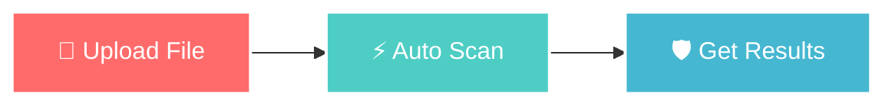
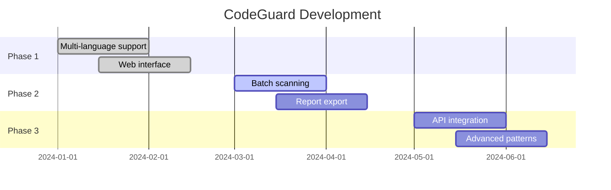

# 🛡️ CodeGuard

<div align="center">


**🚀 Drag. Drop. Secure. All in your browser.**

[](https://python.org)
[](https://flask.palletsprojects.com/)
[](#)

</div>

---

## ⚡ What is CodeGuard?

<table>
<tr>
<td width="60%">

**CodeGuard** is a lightning-fast web-based vulnerability scanner that analyzes your code in seconds. Upload any file, get instant security insights.

**🎯 Perfect for:**
- 🔍 Quick security audits
- 🎓 Learning secure coding  
- 🛡️ Pre-commit checks
- 📊 Code reviews

</td>
<td width="40%">

```python
# Just upload and scan!
def vulnerable_code():
    password = "admin123"  # ⚠️ Detected!
    eval(user_input)       # ⚠️ Detected!
    return "Scanned ✅"
```

</td>
</tr>
</table>

---

## 🚀 **Quick Start**

<div align="center">

### 3 Steps to Secure Code


```mermaid
graph LR
    A[📁 Upload File] --> B[⚡ Auto Scan]
    B --> C[🛡️ Get Results]
    
    style A fill:#ff6b6b,stroke:#fff,stroke-width:2px,color:#fff
    style B fill:#4ecdc4,stroke:#fff,stroke-width:2px,color:#fff  
    style C fill:#45b7d1,stroke:#fff,stroke-width:2px,color:#fff
```

</div>

```bash
# Clone & Run
git clone https://github.com/ZeroHack01/CodeGuard.git
cd CodeGuard && pip install flask
python app.py

# Open browser → localhost:5000 🌐
```

---

## 🎯 **Language Support**

<div align="center">

| 🐍 Python | 🟨 JavaScript | 🌐 PHP | ☕ Java |
|-----------|---------------|---------|---------|
| `eval()` injection | XSS patterns | Code execution | Shell commands |
| Hardcoded secrets | DOM manipulation | DB passwords | Unsafe Runtime calls |
| **✅ Syntax Check** | Unsafe functions | File inclusion | Credential leaks |

| 🐚 Shell | 💻 C/C++ | 📄 HTML | 🔧 More |
|----------|----------|---------|---------|
| `rm -rf` danger | Buffer overflows | Script injection | **Coming Soon** |
| `curl \| bash` | `system()` calls | Inline scripts | Ruby, Go, Rust |

</div>

---

## 📊 **Live Demo**

<details>
<summary><b>🎬 See CodeGuard in Action</b></summary>

```
🌐 Upload: vulnerable_app.py
⚡ Scanning...

╭─────────────────────────────────────╮
│  🛡️  CodeGuard Results             │
├─────────────────────────────────────┤
│  📁 File: vulnerable_app.py         │
│  🔍 Language: PYTHON                │
│  ⏱️  Scan time: 0.8s                │
╰─────────────────────────────────────╯

🚨 Issues Found:

Line 12: password = "secret123"
⚠️  Hardcoded password

Line 18: eval(request.args.get('cmd'))  
🔥 Code injection - CRITICAL

Line 25: os.system(user_command)
⚠️  Shell execution risk

✅ Scan complete: 3 vulnerabilities detected
```

</details>

---

## 🎨 **Features**

<div align="center">

🌐 **Web Interface** • ⚡ **Instant Results** • 🎯 **8+ Languages** • 🔍 **25+ Patterns**

</div>

<table>
<tr>
<td align="center" width="25%">

<br><b>🚀 Drag & Drop</b>
<br>Simple file upload
</td>
<td align="center" width="25%">

<br><b>🧠 Smart Detection</b>
<br>Language auto-detection
</td>
<td align="center" width="25%">

<br><b>🛡️ Security Focus</b>
<br>OWASP-based patterns
</td>
<td align="center" width="25%">

<br><b>⚡ Lightning Fast</b>
<br>Results in seconds
</td>
</tr>
</table>

---

## 🔧 **Extend CodeGuard**

<details>
<summary><b>💡 Add Custom Patterns</b></summary>

```python
# scanner.py - Add your patterns
'python': {
    "🔥 Custom SQL Injection": r"cursor\.execute.*%.*user",
    "⚠️ Unsafe pickle": r"\bpickle\.loads?\s*\(",
    "🚨 Your pattern here": r"your_regex_pattern"
}
```

</details>

<details>
<summary><b>🌍 Add New Languages</b></summary>

```python
# app.py - Extend support
ALLOWED_EXTENSIONS = {'py', 'js', 'php', 'rb', 'go'}

# scanner.py - Add patterns
'ruby': {
    "🔥 Ruby eval": r"\beval\s*\(",
    "⚠️ System call": r"system\s*\("
}
```

</details>

---

## 🏗️ **Architecture**

<div align="center">

```
   Browser 🌐
      ↓
   Flask App ⚡
      ↓
  Scanner Engine 🔍
      ↓
  Pattern Matching 🎯
      ↓
   Results 📊
```

</div>

---

## 🤝 **Contributing**

<div align="center">

**🌟 Help make CodeGuard better!**

[](https://github.com/ZeroHack01/CodeGuard/issues)
[](https://github.com/ZeroHack01/CodeGuard/pulls)

**💡 Ideas:** Security patterns • New languages • UI improvements • Bug fixes

</div>

---

## 📈 **Roadmap**


```mermaid
gantt
    title CodeGuard Development
    dateFormat  YYYY-MM-DD
    section Phase 1
    Multi-language support     :done, 2024-01-01, 2024-02-01
    Web interface             :done, 2024-01-15, 2024-02-15
    section Phase 2  
    Batch scanning            :active, 2024-03-01, 2024-04-01
    Report export             :2024-03-15, 2024-04-15
    section Phase 3
    API integration           :2024-05-01, 2024-06-01
    Advanced patterns         :2024-05-15, 2024-06-15
```

---

<div align="center">

## 💫 **Ready to Secure Your Code?**

[](https://github.com/ZeroHack01/CodeGuard)
[](https://github.com/ZeroHack01/CodeGuard)

**Made with ❤️ by [@ZeroHack01](https://github.com/ZeroHack01)**


</div>
