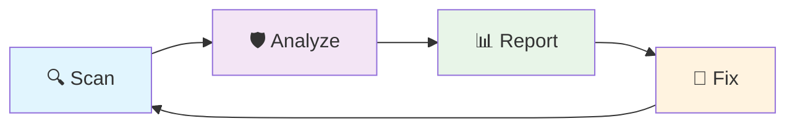

# 🛡️ CodeGuard

<div align="center">


**🔒 Advanced Code Protection & Security Analysis Tool**

[](https://choosealicense.com/licenses/mit/)
[](https://python.org)
[](https://github.com/ZeroHack01/CodeGuard)
[](https://github.com/ZeroHack01/CodeGuard)

*Protecting your code, one scan at a time* ⚡

[🚀 **Get Started**](#-quick-start) • [📖 **Documentation**](#-documentation) • [🤝 **Contributing**](#-contributing) • [🐛 **Report Bug**](https://github.com/ZeroHack01/CodeGuard/issues)

</div>

---

## 🌟 **What is CodeGuard?**

**CodeGuard** is a powerful, next-generation code security analysis tool designed to identify vulnerabilities, enforce coding standards, and protect your applications from potential threats. Built with modern development workflows in mind, it seamlessly integrates into your CI/CD pipeline.

### ✨ **Key Highlights**


```mermaid
graph LR
    A[🔍 Scan] --> B[🛡️ Analyze]
    B --> C[📊 Report]
    C --> D[🔧 Fix]
    D --> A
    style A fill:#e1f5fe
    style B fill:#f3e5f5
    style C fill:#e8f5e8
    style D fill:#fff3e0
```

---

## 🚀 **Features**

<table>
<tr>
<td width="50%">

### 🔐 **Security Features**
- 🕵️ **Vulnerability Detection** - OWASP Top 10 coverage
- 🛡️ **Static Code Analysis** - Deep pattern matching
- 🔍 **Dependency Scanning** - Known CVE detection
- 🚨 **Real-time Monitoring** - Continuous security checks
- 📈 **Risk Assessment** - Intelligent threat scoring

</td>
<td width="50%">

### ⚡ **Performance Features**
- 🚄 **Lightning Fast** - Optimized scanning engine
- 🔄 **CI/CD Integration** - GitHub Actions, Jenkins support
- 📊 **Detailed Reports** - HTML, JSON, PDF outputs
- 🎯 **Custom Rules** - Tailored security policies
- 🌐 **Multi-language** - Python, JavaScript, Java, C++

</td>
</tr>
</table>

---

## 🎯 **Quick Start**

### 📋 **Prerequisites**

```bash
# Ensure you have Python 3.8+ installed
python --version
# Python 3.8.0 or higher required
```

### 🔧 **Installation**

<details open>
<summary><b>📦 Option 1: PyPI Installation (Recommended)</b></summary>

```bash
# Install CodeGuard from PyPI
pip install codeguard

# Verify installation
codeguard --version
```

</details>

<details>
<summary><b>🛠️ Option 2: Source Installation</b></summary>

```bash
# Clone the repository
git clone https://github.com/ZeroHack01/CodeGuard.git
cd CodeGuard

# Install dependencies
pip install -r requirements.txt

# Install in development mode
pip install -e .
```

</details>

### ⚡ **Basic Usage**

```bash
# Scan a single file
codeguard scan myfile.py

# Scan entire directory
codeguard scan ./src --recursive

# Generate detailed report
codeguard scan ./project --output report.html --format html

# Run with custom rules
codeguard scan ./code --config custom-rules.yaml
```

---

## 📊 **Example Output**

<div align="center">

```
╭──────────────────────────────────────────────────────────────╮
│                    🛡️  CodeGuard Results                     │
├──────────────────────────────────────────────────────────────┤
│  📁 Files Scanned: 156                                      │
│  🔍 Issues Found: 23                                        │
│  🚨 Critical: 3     ⚠️  High: 8     📋 Medium: 12           │
│  ⏱️  Scan Time: 2.3s                                        │
╰──────────────────────────────────────────────────────────────╯

🚨 Critical Issues:
  • SQL Injection vulnerability in user_auth.py:42
  • Hardcoded API key in config.py:15
  • XSS vulnerability in template.html:28

💡 Recommendation: Address critical issues immediately
```

</div>

---

## 🛠️ **Configuration**

Create a `.codeguard.yml` file in your project root:

```yaml
# CodeGuard Configuration
version: "1.0"

# Scan settings
scan:
  recursive: true
  exclude:
    - "*.test.js"
    - "node_modules/"
    - ".git/"
  
# Security rules
rules:
  sql_injection: enabled
  xss_detection: enabled
  hardcoded_secrets: enabled
  insecure_random: enabled

# Output settings
output:
  format: ["html", "json"]
  severity_threshold: "medium"
  
# Integrations
integrations:
  github_actions: true
  slack_notifications: false
```

---

## 🔧 **Advanced Usage**

### 🤖 **CI/CD Integration**

<details>
<summary><b>GitHub Actions</b></summary>

```yaml
name: CodeGuard Security Scan
on: [push, pull_request]

jobs:
  security-scan:
    runs-on: ubuntu-latest
    steps:
      - uses: actions/checkout@v3
      - name: Setup Python
        uses: actions/setup-python@v4
        with:
          python-version: '3.9'
      - name: Install CodeGuard
        run: pip install codeguard
      - name: Run Security Scan
        run: codeguard scan . --output security-report.json
      - name: Upload Results
        uses: actions/upload-artifact@v3
        with:
          name: security-report
          path: security-report.json
```

</details>

<details>
<summary><b>Jenkins Pipeline</b></summary>

```groovy
pipeline {
    agent any
    stages {
        stage('Security Scan') {
            steps {
                sh 'pip install codeguard'
                sh 'codeguard scan . --output security-report.xml --format junit'
                publishTestResults testResultsPattern: 'security-report.xml'
            }
        }
    }
}
```

</details>

### 🎛️ **Custom Rules**

Create custom security rules to match your specific requirements:

```python
# custom_rules.py
from codeguard.rules import Rule, Severity

class CustomAPIKeyRule(Rule):
    name = "custom_api_key_detection"
    severity = Severity.HIGH
    
    def check(self, code_line):
        patterns = [
            r'api_key\s*=\s*["\'][^"\']{20,}["\']',
            r'API_TOKEN\s*=\s*["\'][^"\']{32,}["\']'
        ]
        return any(re.search(pattern, code_line) for pattern in patterns)
```

---

## 📈 **Supported Languages & Frameworks**

<div align="center">

| Language | Support Level | Frameworks |
|----------|---------------|------------|
| 🐍 **Python** | ⭐⭐⭐⭐⭐ | Django, Flask, FastAPI |
| 🟨 **JavaScript** | ⭐⭐⭐⭐⭐ | React, Vue, Angular, Node.js |
| ☕ **Java** | ⭐⭐⭐⭐ | Spring, Struts |
| 🔷 **TypeScript** | ⭐⭐⭐⭐ | Angular, React |
| 🅒 **C/C++** | ⭐⭐⭐ | Native applications |
| 🔷 **C#** | ⭐⭐⭐ | .NET Framework |
| 🌐 **PHP** | ⭐⭐⭐ | Laravel, Symfony |
| 💎 **Ruby** | ⭐⭐⭐ | Rails |

</div>

---

## 📖 **Documentation**

<div align="center">

| Section | Description | Link |
|---------|-------------|------|
| 🚀 **Getting Started** | Basic installation and usage | [📖 View](docs/getting-started.md) |
| 🔧 **Configuration** | Advanced configuration options | [📖 View](docs/configuration.md) |
| 🛡️ **Security Rules** | Built-in and custom rules | [📖 View](docs/security-rules.md) |
| 🔌 **Integrations** | CI/CD and tool integrations | [📖 View](docs/integrations.md) |
| 🤝 **API Reference** | Developer API documentation | [📖 View](docs/api-reference.md) |

</div>

---

## 🤝 **Contributing**

We ❤️ contributions! CodeGuard is an open-source project that thrives on community involvement.

### 🌟 **Ways to Contribute**

- 🐛 **Report Bugs** - Help us improve by reporting issues
- 💡 **Feature Requests** - Suggest new features and enhancements  
- 🔧 **Code Contributions** - Submit pull requests
- 📖 **Documentation** - Improve our docs and examples
- 🧪 **Testing** - Help us test new features

### 🚀 **Development Setup**

```bash
# Fork and clone the repository
git clone https://github.com/YOUR-USERNAME/CodeGuard.git
cd CodeGuard

# Create virtual environment
python -m venv codeguard-env
source codeguard-env/bin/activate  # On Windows: codeguard-env\Scripts\activate

# Install development dependencies
pip install -r requirements-dev.txt

# Run tests
pytest tests/

# Run linting
flake8 codeguard/
black codeguard/
```

---

## 📊 **Project Stats**

<div align="center">


**Activity Overview**
```
📈 Commits this month: 47
👥 Contributors: 12
🔧 Issues resolved: 23
🚀 Latest release: v2.1.0
```

</div>

---

## 🏆 **Recognition**

<div align="center">

🥇 **Featured in:** *Awesome Security Tools 2024*  
🎖️ **Recognized by:** *OWASP Community*  
⭐ **Rating:** *4.8/5 stars* on tool review platforms

</div>

---

## 📜 **License**

This project is licensed under the **MIT License** - see the [LICENSE](LICENSE) file for details.

```
MIT License - Feel free to use, modify, and distribute
Copyright (c) 2024 ZeroHack01
```

---

## 🙏 **Acknowledgments**

- 🛡️ **OWASP Community** for security guidelines
- 👥 **All Contributors** who make this project possible
- 🔧 **Open Source Libraries** that power CodeGuard
- 💡 **Security Researchers** for vulnerability insights

---

<div align="center">

### 💬 **Get in Touch**

[](https://github.com/ZeroHack01)
[](https://twitter.com/ZeroHack01)
[](https://discord.gg/codeguard)

**Made with ❤️ by the CodeGuard Team**

⭐ **Star this repo if CodeGuard helped secure your code!** ⭐

</div>

---

<div align="center">
<sub>
🔒 Securing code, one repository at a time • 
Built for developers, by developers • 
Always free and open source
</sub>
</div>
